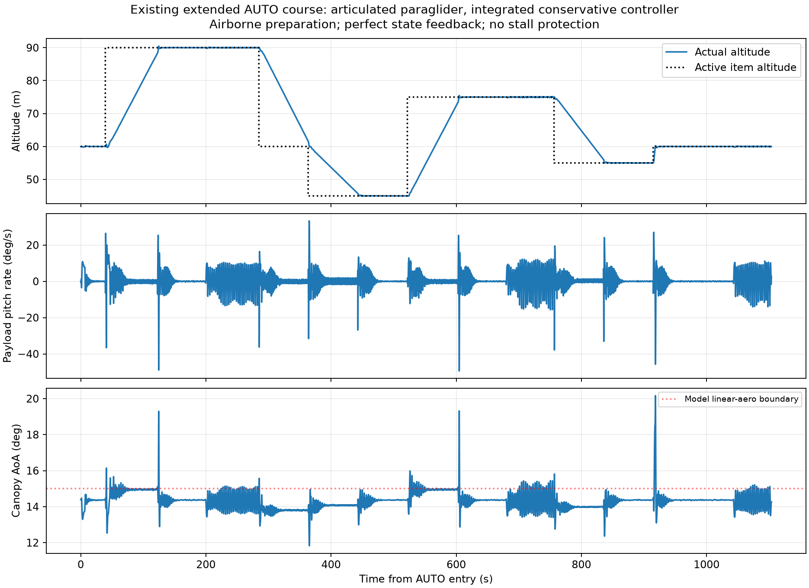
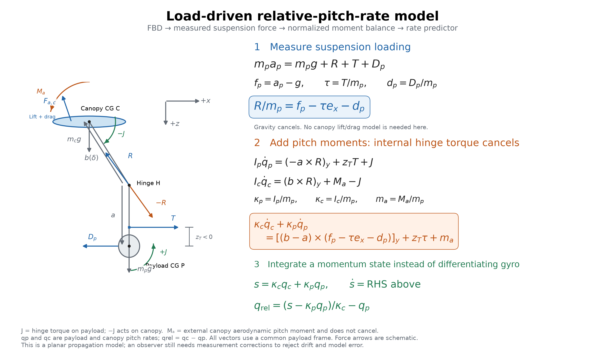

# Can relative pitch unlock better longitudinal control?

The longitudinal problem I want to solve is how to use as much control bandwidth as possible without stalling the canopy or driving the canopy and payload into large oscillations. After seeing self-excitation from my throttle pitch damper, I was not convinced that motion-profile limiting alone would get me the performance I wanted. I suspected the controller needed some awareness of the relative angles and rates.

Before taking on an observer, I asked us to try controllers that could read the simulated joint state directly. That gave us a way to ask whether the information was useful at all, and what remained difficult even with perfect access to it. These local truth-state prototypes are research; they are not included in the durable ArduPilot branch.

## First, test whether joint-state feedback helps

We first kept TECS and added canopy/payload rate feedback ahead of motor lag, working through 44 trials. A useful correction was approximately `Δthrottle = -0.56 q_canopy + 0.16 q_payload`, with rates in rad/s. In a matched faster-TECS case, payload pitch-rate RMS fell from 4.69 to 2.95 deg/s. Relative-rate information supplied most of the benefit; matched payload-only feedback achieved 5.02 deg/s. This reduced oscillation but did not demonstrate a large usable bandwidth increase.

I then asked us to try a controller update that treated the longitudinal system more directly. We tested integrated longitudinal control in a subsequent 21-trial study. Strong direct-throttle LQI gains became unstable with actuator timing/slew. The final conservative prototype commands throttle rate at 50 Hz, including motor lag, command state, saturation and conditional integral antiwindup. Its states include payload pitch, relative angle/rate, payload rate, air-relative velocity, motor throttle, previous command and climb-error integral.

| Matched step case | Climb tracking RMS | Payload rate RMS | Settling time |
|---|---:|---:|---:|
| Faster TECS baseline | 0.12851 m/s | 4.6922 deg/s | 12.04 s |
| Prior joint feedback | 0.09708 m/s | 2.9541 deg/s | 5.46 s |
| Conservative integrated | 0.07978 m/s | 2.3915 deg/s | 2.70 s |
| Faster integrated | 0.07123 m/s | 3.5172 deg/s | 2.20 s |


The conservative setting was encouraging: it also improved rate RMS in zero-joint-damping, slower-motor and shifted-thrust-line checks. The severe gust cases showed how much work remained: about 38 deg/s rate RMS and angles of attack outside the calibrated model. At 0.32 Hz the whole-loop gain peak fell from 3.35 to 2.11, with more phase lag; the height outer loop still amplified the inner response. This is not proof of a safe high-bandwidth controller.


A local native AUTO course completed in 1103.6 s with maximum corner overshoot 1.079 m. It used an **airborne preparation fixture**, not a normal launch, and reached 20.16 degrees modeled angle of attack. Course assertions passing therefore do not establish stall protection.



[Integrated summary](scratch/paraglider-tests/pitch-joint/integrated-control/summary.json), [validation](scratch/paraglider-tests/pitch-joint/integrated-control/validation.json), [oracle study](scratch/paraglider-tests/pitch-joint/oracle-control/summary.json) and archived scripts provide provenance. Production sources/binaries were restored after these local trials. A payload-pitch transfer had a right-half-plane zero, while the CG climb transfer did not; inverse pitch response alone does not prove a fundamental climb-bandwidth limit.

## Can I estimate what I cannot measure?

The next question was how to get relative pitch information without a hinge-angle sensor. I asked us to assess observability with and without airspeed, rather than assuming an observer would work.

The nominal nine-state linearization we assessed uses payload pitch, relative pitch, payload/relative rates, two air-relative velocity components, motor state and horizontal/vertical wind. With a known model and constant wind, the local PBH assessment gives rank nine with attitude/gyro/GNSS measurements, with or without a pitot sensor. This nominal result is weaker than it sounds: modeling unknown constant force/moment biases adds ambiguous modes.

With four independent constant acceleration/angular disturbances, the thirteen-state assessment gives zero-frequency PBH rank ten without airspeed and eleven with scalar airspeed: respectively three and two unobservable constant directions. This deliberately permissive bias model exposes ambiguity rather than asserting those biases are a physical plant. Relative rate appears more useful than absolute relative angle; a scalar pitot does not measure airflow direction or vertical wind.

I also questioned whether we needed raw IMU data when ArduPilot already has an AHRS interface. Checking those interfaces clarified what is available and where the lever-arm correction still belongs. AHRS gyro is corrected payload angular rate. AHRS earth-frame acceleration is bias-corrected specific force at the IMU, not automatically translated to the payload CG. The corrected delta-velocity interface includes gravity but likewise does not supply that moving-origin correction. EKF navigation position/velocity handle configured rigid-body IMU lever arms; canopy articulation still requires its own geometry. A practical observer should predict specific force at the actual sensor position and use AHRS correction rather than duplicating calibration or differentiating noisy gyro. AHRS/IMU-derived measurements also have correlated errors.

[Assessment script](scratch/paraglider-tests/pitch-joint/observer-design/assess.py) and [ranks/results](scratch/paraglider-tests/pitch-joint/observer-design/assessment.json) are archived. No flight-ready observer or reliable absolute-angle limiter has been implemented.

## How much model identification can we avoid?

Finally, I wanted to revisit the free-body diagram. If this eventually needs to work on a variety of platforms, every inertia, mass and aerodynamic coefficient we ask a user to identify is a practical obstacle. We looked for terms that cancel and ratios that can replace absolute values.



Let `R` be suspension force on the payload, `T` forward thrust, `Dp` payload aerodynamic force, and `fp = ap - g` payload-CG specific force. Define `τ = T/mp`, `dp = Dp/mp`, `κp = Ip/mp`, `κc = Ic/mp`, and `ma = Ma/mp`. Vectors `a` and `b(δ)` run from the hinge to payload and canopy CG in one frame; `zT` is the signed thrust moment arm using the diagram convention.

The payload force balance yields:

```text
R/mp = fp - τ ex - dp
```

Adding payload and canopy pitch equations cancels their equal-and-opposite internal hinge torque:

```text
κc q̇c + κp q̇p = [(b-a) × (fp-τ ex-dp)]y + zT τ + ma
s = κc qc + κp qp
ṡ = [(b-a) × (fp-τ ex-dp)]y + zT τ + ma
qrel = (s-κp qp)/κc - qp
```

This removes the explicit joint stiffness/damping law from the summed momentum propagation and replaces canopy lift/drag force modeling with measured suspension loading. Uniform gravity cancels when translation is eliminated. Absolute mass can be reduced to inertia/mass ratios; `κc = (mc/mp) kc²` if `kc` is canopy radius of gyration. Scaling lengths by a reference suspension length and time by `sqrt(L/g)` improves numerical conditioning.

**The external canopy pitching moment `Ma` does not cancel.** Geometry, inertia ratios, thrust-per-mass/moment arm, payload drag and residual canopy moment still require modeling. Integrating the summed momentum without measurement correction drifts; this cancellation is not a complete observer and does not solve initial-state identifiability. My next step would be to benchmark an uncertainty-aware relative-rate observer against simulation truth, then test control with confidence-dependent limits and recorded flight data. The experiments give me a reason to pursue relative-rate feedback, but they have not yet answered how reliably I can estimate absolute canopy angle or protect the wing at the bandwidth I want.
