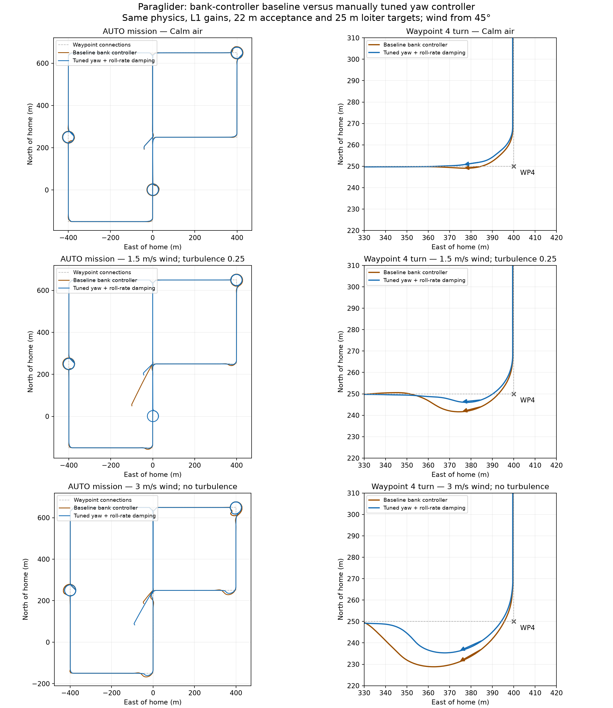
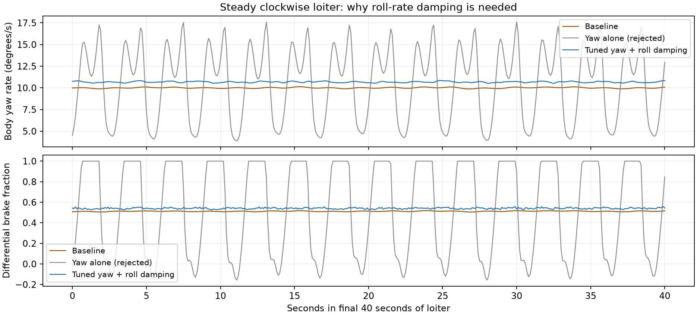
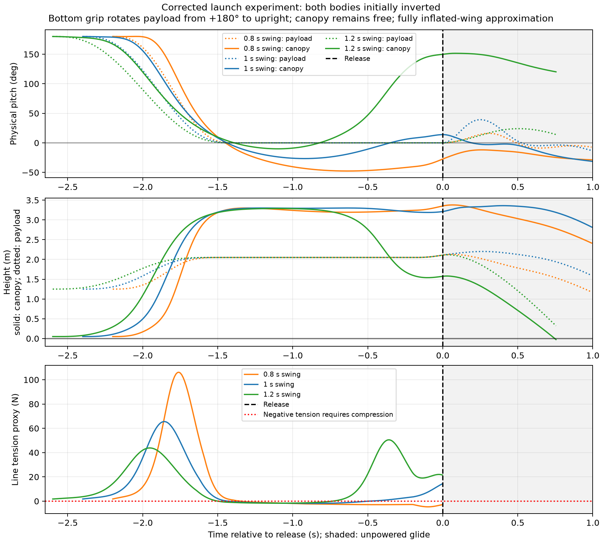

# What does my paraglider need from its controller?

I want the paraglider simulation to help me evaluate control laws. That means asking whether the model captures the motions that matter to a controller, then testing ideas against repeatable missions rather than relying on a reassuring-looking plot.

This work started with getting the paraglider to fly an AUTO mission in SITL. It grew into questions about yaw damping, brake steering, achievable turn radii and the pitch motion between the canopy and payload. The implementation branch now contains a dedicated heading-rate controller, an optional articulated pitch model and native AUTO/hinge tests. I keep the local tuning sweeps and experimental longitudinal controllers here.

## Is the roll controller the right abstraction?

After we substantially increased the roll-to-servo gain, I asked what that parameter actually meant on a paraglider. The original implementation used roll-controller gains as an indirect yaw/turn controller. Increasing roll-to-servo gain largely increased differential-brake authority for turning rather than identifying an ordinary aileron roll loop. I wanted to see whether a dedicated turn controller would make the behavior easier to understand and tune. We implemented and manually tuned a replacement that tracks heading rate directly, with differential-brake feedforward, PI feedback, rate/acceleration limits and coupled roll-rate damping. Feature guards keep paraglider-specific code out of standard builds; legacy/mode handover is tested.

The mission plots also made me question the waypoint radius. We could make the response better damped and still overshoot the next track if the requested turn was too tight. I asked us to base the turn geometry on achievable turn rate, then optimize for tighter turns with less overshoot and repeat the comparison across wind and turbulence. Those experiments helped separate guidance geometry from the steering-loop tuning.

The gains we selected for this SITL model are `PG_TURN_RMAX=25`, `FF=0.051`, `P=0.04`, `I=0.002`, `IMAX=0.15`, `ACCEL=40`, `FILT=4`, `TC=0.1`, `ASPD=5`, `RDAMP=0.03`, `D_FF=0.02`. They accompany `NAVL1_PERIOD=8`, `NAVL1_DAMPING=1`, `WP_RADIUS=22` and `WP_LOITER_RAD=25`. These are model-specific engineering selections, not general flight recommendations.

We ran the selected gains through the normal calm AUTO mission and controller handover test; both passed. Calm corner overshoot was approximately 0.31 m in the selected validation. Results are not universally robust: the 3 m/s steady-wind case exceeded the 4 m corner limit, and turbulence 0.5 caused altitude aborts with both controllers. Each wind condition had a single comparison flight. Failed tuning candidates are retained.

[Yaw validation and selected comparisons](scratch/paraglider-tests/yaw-controller/validation.json) records the exact settings and limitations. I also explored a Lua quicktuner based on Plane autotune and the other tuning scripts, including L1 tuning. I decided it had not yet proven its value, so I kept its source and binding patches separately in provenance and out of the durable branch.

## What fidelity does the simulator need?

When the simulated yaw response oscillated, I wanted to understand whether additional damping could be explained by a higher-fidelity model. Without flight data to identify it, we chose a provisional damping term and added propeller torque reaction. The canopy model builds on [Umenberger and Göktogan, ACRA 2012](https://www.araa.asn.au/acra/acra2012/papers/pap151.pdf). Added yaw damping (`Cnr=-0.05`) is an effective provisional term, and propeller torque reaction uses a provisional −0.02 m torque/thrust ratio. Neither is identified from flight logs. Higher-fidelity canopy/payload coupling can contribute apparent damping, but does not establish these numerical values.

My flight testing raised a more pressing issue: the longitudinal canopy/payload hinge was tricky, and my throttle pitch damper caused enough self-excitation that I zeroed it out. My thrust line is below the hinge, with the CG below that. I asked us to add the joint to SITL and investigate the coupling before the flight logs were available.

The optional pitch joint we implemented separates canopy and payload pitch, with coupled inertias, translation and thrust moment. The payload IMU acceleration includes the moving lever-arm contribution. Roll/yaw remain shared; this is not a complete multibody parafoil model. Representative settings are total mass 1.55 kg, canopy 0.19 kg, payload 1.36 kg, inertias 0.025/0.03 kg m² and joint damping 0.015 N m per rad/s. The payload CG is 0.35 m below the hinge. The modeled thrust line is 0.10 m above that CG, hence still 0.25 m below the hinge.

Pitch-sign conventions and aerodynamic blending were corrected during the experiments. Earlier directories explicitly marked before the aero-sign correction are historical results. The 15-degree linear-aerodynamic boundary and high-angle blend are numerical approximations, not a validated stall or collapse envelope.

The native `ParagliderPitchJoint` test and 20 model unit tests passed; the rigid-model extended AUTO test remains part of normal coverage. Local articulated AUTO runs completed, but those use different configurations and should not be pooled with lateral comparisons. [Physics review](scratch/paraglider-tests/pitch-joint/physics-review/summary.json) records the model assumptions and trim analysis.

## Can the launch start in the right physical state?

My actual launch starts with both payload and canopy upside down. I hold the bottom of the payload, lay the canopy out in a crescent, swing it overhead in about a second, walk two steps once it is inflated, and give it a light toss. I let it glide for about a second before throttling up. I wanted that sequence represented because the release state could matter to the oscillations we were trying to control.

We explored that sequence with provisional geometry and timing. A 1.0 s swing looked more promising than 0.8 or 1.2 s for release orientation, but about 39% of the held trajectory required compression in the assumed suspension constraint. That invalidates a taut-line rigid interpretation of actual inflation. This is a design study, not a validated launch simulation.

The durable SITL throw guide is a synthetic initialization aid; it does not implement the overhead inflation sequence. The model assumes an inflated canopy and does not simulate slack lines, inflation or collapse. [Swing results](scratch/paraglider-tests/pitch-joint/swing-launch/inverted-results.json) retain the checks and assumptions.

## Where that leaves my control questions

The result I find most useful is that relative canopy/payload pitch rate provides damping information unavailable to a payload-only pitch loop. Truth-state controllers demonstrate potential, but an observer and robust protection still need development. See [longitudinal control and observer design](longitudinal-observer.md). I still need to compare against my flight logs before selecting real-aircraft gains or claiming we have quantitatively reproduced the self-excitation I saw.
