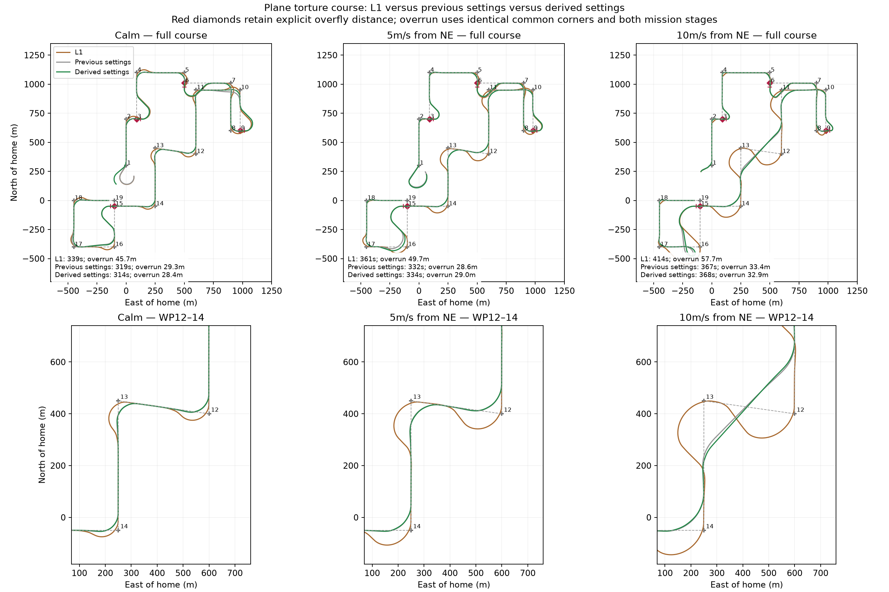
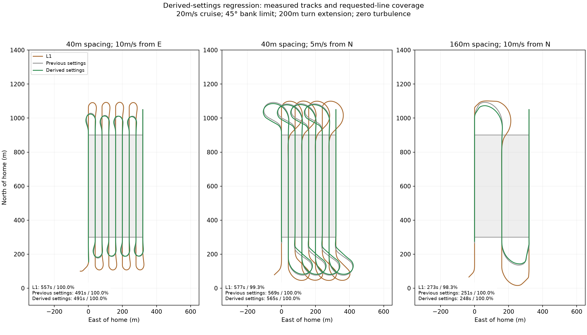
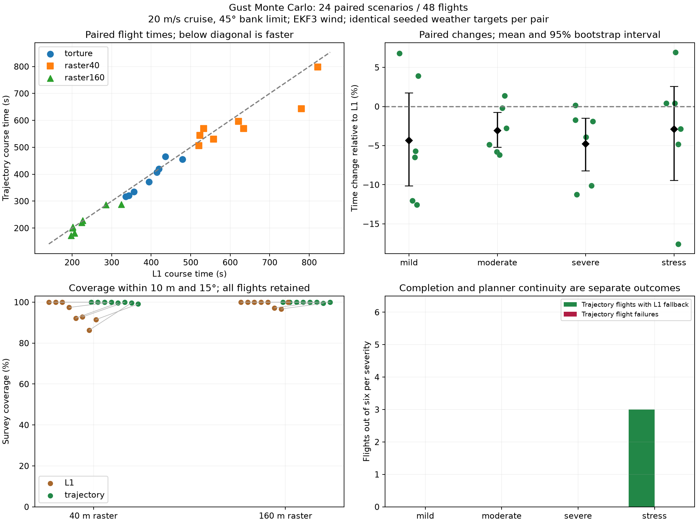
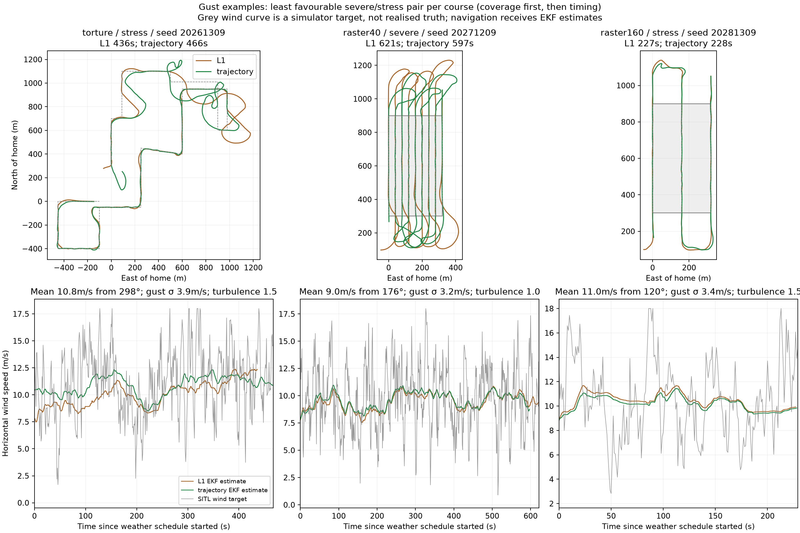

# Can planning turns improve on L1?

My starting question was whether a wind-aware trajectory planner could improve on L1 waypoint tracking. I had been looking at trochoidal paths and a solver that connects start and goal poses, but ArduPilot missions are normally lists of waypoints. I wanted to know how those two representations could fit together, especially when neighboring turns overlap.

I asked us to develop this on a separate Plane branch and build a torture course that would expose difficult transitions. As we compared plots, I realized the first implementation still depended too much on waypoint acceptance radii. What I wanted was a turn planned from one line segment to the next, with room to choose where the turn starts and ends.

The latest planner follows that idea: it connects incoming and outgoing ground-track lines, allows entry and exit positions to move along them, and merges overlapping transitions across short legs.

## From exact poses to flexible line transitions

We began with wind-aware arcs and straight segments that produce trochoidal ground paths. The planner evaluates finite winding candidates, penalizing extra turning instead of rejecting everything beyond an arbitrary 225-degree limit. The tracker uses existing Plane lateral controls. This is trajectory planning and feedback tracking, not a full receding-horizon MPC optimizer.

I also wanted to make sure the planner was using information available on a real aircraft. It uses the **active EKF wind estimate**, airspeed and available bank authority. Planning bank is 70% of the bank limit to reserve feedback authority. Rate follows g tan(bank)/airspeed. Response and capture tolerances derive from L1 period/damping and existing roll-controller response, rate and acceleration limits. I asked us to derive settings from existing aircraft parameters wherever possible. The remaining experimental parameters are `ENABLE` and `EXTENT`: zero extent derives turn space; an explicit extent can protect survey turnaround boundaries. The planner is disabled by default.

Ordinary acceptance radii do not constrain the latest planned turns or mission handover. Explicit pass-by/overfly semantics remain protected. Ordered corner progress governs handover; unsupported or infeasible cases fall back to L1. The fallback is necessary because wind, available space and aircraft limits can make a requested transition infeasible.

The turning point came from the raster comparisons. I asked for a matrix of grid densities, wind speeds and directions, and the 40 m raster in a 10 m/s easterly wind failed badly. Looking at why it failed led me to question both the 225-degree cutoff and the requirement to meet precise start/end poses. L1 seemed able to recover more flexibly.

We removed the arbitrary cutoff and replaced it with a cost for extra turning. That helped the search, but did not solve the geometry by itself. Letting turns enter and leave the adjacent lines at flexible positions, and grouping short legs, addressed the more fundamental constraint. I kept the earlier radius-gated and diagnostic results in the archive, but the comparisons below use the latest planner.

## Testing the idea against L1

Once those changes were in place, we reran the torture course and the raster cases that had exposed the earlier failures. These are representative native course times:

| Raster spacing / wind | L1 time | Latest trajectory time | L1 / trajectory coverage |
|---|---:|---:|---:|
| 40 m / 10 m/s from E | 557.2 s | 490.6 s | 100% / 100% |
| 40 m / 5 m/s from N | 576.7 s | 565.4 s | 99.26% / 100% |
| 160 m / 10 m/s from N | 273.0 s | 248.3 s | 98.33% / 100% |

I then wanted to know whether the improvements would survive gusts rather than just steady wind. We designed a Monte Carlo experiment with 24 paired scenarios: three courses, eight pairs per course, four weather strata and two replicates per stratum. All 48 flights completed; trajectory runs recorded three fallback events. Mean paired flight-time change was **−3.78%**, with bootstrap 95% interval **[−6.10%, −1.41%]**.

| Course | Median L1 time | Median trajectory time | Median L1 / trajectory coverage |
|---|---:|---:|---:|
| Torture | 404.50 s | 389.48 s | Not a raster metric |
| 40 m raster | 589.38 s | 569.85 s | 95.09% / 100% |
| 160 m raster | 215.12 s | 212.46 s | 100% / 100% |

These are medians of individual groups, not the paired percentage statistic. Weather targets were seeded, spatially uniform time-indexed gust schedules replayed on simulation time, with native SITL turbulence. Target schedules matched, but independent sensor/turbulence realizations are not guaranteed bit-identical. The local weather replay harness knows the prescribed weather; the production planner still receives EKF estimates.

## Validation and reproducibility

The recorded production validation passed native waypoint tests, raster regression, 18 unit tests, ten disabled-feature translation-unit builds, parameter metadata and Python style checks. Native tests are `WaypointTrajectory`, `WaypointTrajectoryOverfly` and `WaypointTrajectoryStrongWind` in the linked ArduPilot branch. Rebuild that exact commit and use its normal autotest runner; local raster and gust scripts are in the directories below.

- [Production validation](scratch/plane-trajectory/derived-settings/validation.json)
- [Regression measurements](scratch/plane-trajectory/derived-settings/regression/comparison.json)
- [Monte Carlo summary](scratch/plane-trajectory/derived-settings/monte-carlo/summary.json)
- [Scenario definitions](scratch/plane-trajectory/derived-settings/monte-carlo/scenarios.json)
- [Monte Carlo runner](scratch/plane-trajectory/derived-settings/monte-carlo/run.py)

I take these results as evidence that flexible line transitions are worth pursuing: this test set improved course time and dense-raster coverage. I do not yet have evidence of a general advantage across aircraft and weather fields. This is a small stratified engineering experiment, not a reliability estimate; coverage depends on the archived metric and geometry. I still need flight validation of the planner assumptions and feedback reserve.

The references that prompted this investigation were: [trochoid planning](https://bradymoon.com/trochoids) and [the supplied arXiv paper](https://arxiv.org/abs/2306.11845).
